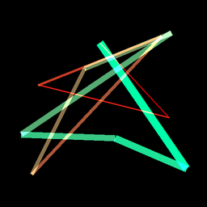

# Generative-NFT-ART

## Output

In the output, we will have the actual artwork itself, like this:



There will also be a meta-data file.

## Creation Process

Each item is generated by an algorithm. The first step is to pick the primary colors for the artwork.
I pick a random HSV value in a range, then a secondary color based off of that.

```python
def random_color():
    h = random.random()
    s = 1
    v = 1
    float_rgb = colorsys.hsv_to_rgb(h, s, v)
    rgb = [int(x*255) for x in float_rgb]
    return tuple(rgb)
```

I also name the colors (this is important later) using a color-lookup table that picks the closest (Euclidean distance) match on its HSV value.

```python

class ColorNameMapper:
    def __init__(self, hex_color_map: str) -> None:
        self.color_names: List[Color] = []
        ...
```

The art itself is then generated by drawing a series of connected lines, with variable thickness. The color and thickness changes between each point. These colors, points, and thickness are then serialized into a code like this:

```
A:512:332823:29ff00:392.293.12:341.337.16:208.141.20:294.207.24:392.293.12:196.286.28:119.371.32:139.350.36:137.330.40:392.293.12
```

...which is then used to render the image. In this way, the meta-data also contains a redundant back-up of the image itself.

## ERC 721

I've also added the test ERC-721 contract I was planning to use to mint these, but I didn't go ahead
with it because of the gas fees (approx. $1200 at time of writing) to deploy the contract.

I did test it briefly on the Ropsten network though, and it should be reasonable to build out into
a working contract if I need it someday.
